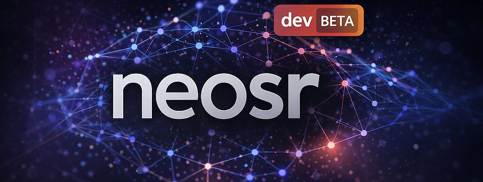

<div align="center">
</img>

<a href="https://discord.gg/NN2HGtJ3d6"></img></a><br>
Join our <a href="https://discord.gg/NN2HGtJ3d6">Discord</a>
</div>

[neosr](https://github.com/neosr-project/neosr) is an open-source framework for training super-resolution models. It provides a comprehensive and reproducible environment for achieving state-of-the-art image restoration results, making it suitable for both the enthusiastic community, professionals and machine learning academic researchers. It serves as a versatile platform and aims to bridge the gap between practical application and academic research in the field.

- **Accessible**: implements a wide range of the latest advancements in single-image super-resolution networks, losses, optimizers and augmentations. Users can easily explore, adapt and experiment with various configurations for their specific needs, even without coding skills.

- **Efficient**: optimized for faster training iterations, quicker convergence and low GPU requirements, making it the most efficient choice for both research and practical use cases.

- **Practical**: focuses on the real-world use of super-resolution to realistically restore degraded images in various domains, including photos, anime/cartoons, illustrations and more. It's also suitable for critical applications like medical imaging, forensics, geospatial and others (although caution should be taken in those cases).

- **Reproducible**: this framework emphasizes the importance of reproducible research. It provides deterministic training environments that can create bit-exact reproducible models (on the same platform), ensuring predictable and reliable results, which are essential for maintaining consistency in academic validation.

- **Simple**: features are easy to implement or modify. Code is written in readable Python, no fancy styling. All code is managed, validated and formatted by [`uv`](https://docs.astral.sh/uv/), [`ruff`](https://docs.astral.sh/ruff/), [`mypy`](https://www.mypy-lang.org/) and [`torchfix`](https://github.com/pytorch-labs/torchfix).

For more information see our [wiki](https://github.com/neosr-project/neosr/wiki).

## 🤝 support the project

> [!TIP]
> Consider supporting the project on [**KoFi**](https://ko-fi.com/neosr) &#9749; or [**Patreon**](https://www.patreon.com/neosr)

## 💻 installation

Requires CUDA >=12.4

**Windows**:
```ps1
powershell -ExecutionPolicy ByPass -c "irm https://raw.githubusercontent.com/neosr-project/neosr/refs/heads/master/install_windows.ps1 | iex"
```

**Linux**:
```bash
curl -LsSf https://raw.githubusercontent.com/neosr-project/neosr/refs/heads/master/install_linux.sh | sh
```
Note: `neosr` will be installed on your terminal current path.

To update neosr, run:
```bash
neosr-update
```

For manual installation (recommended for cloud env) details, see our [Installation Instructions](https://github.com/neosr-project/neosr/wiki/Installation-Instructions) wiki.

### 🛠️ manual dependency management (uv + conda)

The project uses [`uv`](https://docs.astral.sh/uv/) with the lockfile `uv.lock` and the `uv_build` backend defined in `pyproject.toml` to keep dependencies reproducible. The steps below show how to set up, update, and run the code without the helper scripts.

> [!NOTE]
> Python 3.13 is required. If you prefer virtualenv instead of conda, replace the environment creation step with your preferred tool but keep using `uv` for installs.

**Linux (e.g., Arch Linux)**

1. Install Miniforge (minimal conda). Follow the [official installer](https://github.com/conda-forge/miniforge) or download and run:
   ```bash
   wget https://github.com/conda-forge/miniforge/releases/latest/download/Miniforge3-Linux-x86_64.sh
   bash Miniforge3-Linux-x86_64.sh -b -p "$HOME/miniforge3"
   source "$HOME/miniforge3/etc/profile.d/conda.sh"
   conda config --set auto_activate_base false
   ```
2. Create and activate a Python 3.13 environment:
   ```bash
   conda create -y -n neosr python=3.13
   conda activate neosr
   ```
3. Install `uv` and ensure it is on your `PATH`:
   ```bash
   curl -LsSf https://astral.sh/uv/install.sh | sh
   export PATH="$HOME/.local/bin:$PATH"
   ```
4. Install project dependencies from the lockfile:
   ```bash
   uv sync --locked
   ```
5. Update dependencies later (optional):
   ```bash
   uv lock --upgrade           # refresh uv.lock to the latest compatible versions
   uv sync --locked            # apply updated lockfile to the env
   ```
6. Run training or testing scripts manually:
   ```bash
   uv run python train.py options/your_config.toml
   uv run python test.py options/your_config.toml
   ```

**Windows (PowerShell)**

1. Install [Miniforge for Windows](https://github.com/conda-forge/miniforge) and open a Miniforge prompt.
2. Create and activate the environment:
   ```ps1
   conda create -y -n neosr python=3.13
   conda activate neosr
   ```
3. Install `uv`:
   ```ps1
   powershell -ExecutionPolicy Bypass -c "irm https://astral.sh/uv/install.ps1 | iex"
   $env:Path = "$env:UserProfile\.local\bin;$env:Path"
   ```
4. Install dependencies (uses the bundled PyTorch CUDA 12.8 wheels configured in `pyproject.toml`):
   ```ps1
   uv sync --locked
   ```
5. Update dependencies later:
   ```ps1
   uv lock --upgrade
   uv sync --locked
   ```
6. Run training or testing:
   ```ps1
   uv run python train.py options/your_config.toml
   uv run python test.py options/your_config.toml
   ```

## ⏩ quick start

Start training by running:

```bash
neosr-train config.toml
```
Where `config.toml` is a configuration file. Templates can be found in [options](options/).

> [!TIP]
> Please read the wiki [Configuration Walkthrough](https://github.com/neosr-project/neosr/wiki/Configuration-Walkthrough) for an explanation of each option.

## ✨ features

### [supported archs](https://github.com/neosr-project/neosr/wiki/Arch%E2%80%90specific-options):

| arch                                                                                              | option                                                                           | date  | weight                                   |
|---------------------------------------------------------------------------------------------------|----------------------------------------------------------------------------------|-------|------------------------------------------|
| [Real-ESRGAN](https://github.com/xinntao/Real-ESRGAN)                                             | `esrgan`                                                                          | 2021  | Medium heavy                            |
| [SRVGGNetCompact](https://github.com/XPixelGroup/BasicSR/blob/master/basicsr/archs/srvgg_arch.py) | `compact`                                                                         | 2021  | Ultra light                              |
| [SwinIR](https://github.com/JingyunLiang/SwinIR)                                                  | `swinir_small`, `swinir_medium`, `swinir_large`                                  | 2021  | Medium heavy / Medium heavy / Heavy      |
| [HAT](https://github.com/XPixelGroup/HAT)                                                         | `hat_s`, `hat_m`, `hat_l`                                                         | 2022  | Ultra heavy / Ultra heavy / Ultra heavy  |
| [OmniSR](https://github.com/Francis0625/Omni-SR)                                                  | `omnisr`                                                                          | 2023  | Medium heavy                            |
| [SRFormer](https://github.com/HVision-NKU/SRFormer)                                               | `srformer_light`, `srformer_medium`                                               | 2022  | Medium heavy / Heavy                     |
| [DAT](https://github.com/zhengchen1999/dat)                                                       | `dat_small`, `dat_medium`, `dat_2`                                                | 2022  | Heavy / Heavy / Heavy                    |
| [DITN](https://github.com/yongliuy/DITN)                                                          | `ditn`                                                                            | 2023  | Medium heavy                            |
| [DCTLSA](https://github.com/zengkun301/DCTLSA)                                                    | `dctlsa`                                                                          | 2024  | Medium heavy                            |
| [SPAN](https://github.com/hongyuanyu/SPAN)                                                        | `span`, `span_fast`                                                               | 2023  | Medium / Light                           |
| [SPANPlus](https://github.com/umzi2/SPANPlus)                                                     | `spanplus`, `spanplus_sts`, `spanplus_s`, `spanplus_st`                           | 2024  | Medium / Ultra light / Medium / Light    |
| [Real-CUGAN](https://github.com/bilibili/ailab)                                                   | `cugan`                                                                           | 2022  | Medium heavy                            |
| [CRAFT](https://github.com/AVC2-UESTC/CRAFT-SR)                                                   | `craft`                                                                           | 2023  | Medium                                   |
| [SAFMN](https://github.com/sunny2109/SAFMN)                                                       | `safmn`, `safmn_l`, `light_safmnpp`                                               | 2023  | Light / Medium / Light                   |
| [RGT](https://github.com/zhengchen1999/RGT)                                                       | `rgt`, `rgt_s`                                                                    | 2023  | Medium heavy / Medium                    |
| [ATD](https://github.com/LabShuHangGU/Adaptive-Token-Dictionary)                                  | `atd`, `atd_light`                                                                | 2024  | Heavy / Heavy                            |
| [PLKSR](https://github.com/dslisleedh/PLKSR)                                                      | `plksr`, `plksr_tiny`                                                             | 2023  | Light / Light                            |
| [RealPLKSR](https://github.com/dslisleedh/PLKSR/issues/4)                                         | `realplksr`, `realplksr_s`, `realplksr_l`                                         | 2023  | Medium / Medium / Medium heavy           |
| [DRCT](https://github.com/ming053l/DRCT)                                                          | `drct`, `drct_l`, `drct_xl`, `drct_s`                                             | 2024  | Heavy / Ultra heavy / Ultra heavy / Heavy |
| [MSDAN](https://github.com/Supereeeee/MSDAN)                                                      | `msdan`                                                                           | 2024  | Medium heavy                            |
| [HiT-SRF](https://github.com/XiangZ-0/HiT-SR)                                                     | `hit_srf`, `hit_srf_medium`, `hit_srf_large`                                      | 2024  | Medium heavy / Heavy / Heavy             |
| [HMA](https://github.com/korouuuuu/HMA)                                                           | `hma`, `hma_medium`, `hma_large`                                                  | 2024  | Medium heavy / Heavy / Heavy             |
| [EQSR-GAN](https://github.com/justi8/EQSR-GAN)                                                    | `eqrsrgan`                                                                        | 2024  | Medium heavy                            |
| [ASID](https://github.com/saturnian77/ASID)                                                       | `asid`, `asid_d8`                                                                 | 2024  | Medium / Medium heavy                     |
| [MoSRV2](https://github.com/umzi2/MoSRV2)                                                         | `mosrv2`                                                                          | 2024  | Medium                                   |
| [ESC](https://github.com/dslisleedh/ESC)                                                          | `esc`, `esc_light`, `esc_fp`, `esc_large`                                         | 2024  | Medium / Light / Light / Medium heavy     |
| [CATANet](https://github.com/EquationWalker/CATANet)                                              | `catanet`                                                                         | 2024  | Medium heavy                            |
| [LMLT](https://github.com/jwgdmkj/LMLT)                                                           | `lmlt`, `lmlt_tiny`, `lmlt_large`                                                 | 2024  | Medium / Light / Medium                   |
| [PlainUSR](https://github.com/icandle/PlainUSR)                                                   | `plainusr`, `plainusr_ultra`, `plainusr_large`                                    | 2024  | Medium / Light / Medium heavy             |
| [SebiCA](https://github.com/idiosyncracies/Sebica)                                                | `sebica`, `sebica_mini`                                                           | 2024  | Ultra light / Ultra light                 |
| [GRFormer](https://github.com/sisrformer/GRFormer)                                                | `grformer`, `grformer_medium`, `grformer_large`                                   | 2024  | Medium heavy / Heavy / Heavy              |
| [KRGN](https://github.com/ZhangDY827/KRGN)                                                        | `krgn`                                                                            | 2024  | Medium heavy                            |
| [CFSR](https://github.com/Aitical/CFSR)                                                           | `cfsr`                                                                            | 2024  | Medium heavy                            |
| [MAN](https://github.com/icandle/MAN)                                                             | `man`, `man_tiny`, `man_light`                                                    | 2024  | Medium heavy / Medium / Medium            |
| [EIMN](https://github.com/liux520/EIMN)                                                           | `eimn`, `eimn_a`, `eimn_l`                                                        | 2024  | Medium / Medium / Medium                  |
| [RCAN](https://github.com/yulunzhang/RCAN)                                                        | `rcan`                                                                            | 2018  | Medium                                   |
| [DeSRGAN](https://github.com/neosr-project/neosr/blob/master/neosr/archs/desrgan_arch.py)         | `desrgan`                                                                         | 2024  | Medium heavy                            |
| [DCTSR](https://github.com/neosr-project/neosr/blob/master/neosr/archs/dct_arch.py)               | `dct`                                                                             | 2024  | Medium                                   |
| [MoeSR](https://github.com/umzi2/MoESR)                                                           | `moesr`                                                                           | 2024  | Medium heavy                            |
| [PancamSR](https://github.com/neosr-project/neosr/blob/master/neosr/archs/pancam_arch.py)         | `pancamsr`                                                                        | 2024  | Medium                                   |
| [SwinIR-Dense](https://github.com/neosr-project/neosr/blob/master/neosr/archs/swinirdense_arch.py) | `swinirdense`                                                                     | 2024  | Ultra heavy                              |
| [FlexNet](https://github.com/umzi2/FlexNet)                                                       | `flexnet`, `metaflexnet`                                                          | 2024  | Medium heavy / Medium heavy               |
| [NinaSR](https://github.com/Coloquinte/torchSR/blob/main/doc/NinaSR.md)                           | `ninasr`, `ninasr_b0`, `ninasr_b2`                                                | 2020  | Light / Light / Medium                    |
| [HASN](https://github.com/nathan66666/HASN)                                                       | `hasn`                                                                            | 2024  | Medium heavy                            |
> [!NOTE]
> For all arch-specific parameters, [read the wiki](https://github.com/neosr-project/neosr/wiki/Arch%E2%80%90specific-options).
> Weights reflect approximate resource demands (compute + VRAM) using the project's `architecture_categories.json` plus best-effort estimates for newer models.

#### under testing

| arch                                                                          | option                          | date  | weight          |
|-------------------------------------------------------------------------------|---------------------------------|-------|-----------------|
| [MFG-HMoE](https://github.com/Mr-Bamboo/MFG-HMoE)                             | `mfghmoe`                      | 2024  | Ultra heavy     |
| [MicroSR](https://github.com/YanHuiGUO/Submission-for-NTIRE-2025-SR-x4-)      | `microsr`, `microsr_light`     | 2025  | Light / Ultra light |

### [supported discriminators](https://github.com/neosr-project/neosr/wiki/Arch%E2%80%90specific-options#discriminators):

| net                                                                           | option                        | date  |
|-------------------------------------------------------------------------------|-------------------------------|-------|
| U-Net w/ SN                                                                   | `unet`                        | 2015  |
| [PatchGAN](https://github.com/NVIDIA/pix2pixHD) w/ SN                         | `patchgan`                    | 2018  |
| EA2FPN (bespoke, based on [A2-FPN](https://github.com/lironui/A2-FPN))        | `ea2fpn`                      | 2024  |
| [DUnet](https://github.com/umzi2/DUnet)                                       | `dunet`                       | 2024  |
| [MetaGan](https://github.com/umzi2/MetaGan)                                   | `metagan`                     | 2024  |
| [ResGAN](https://github.com/neosr-project/neosr/blob/master/neosr/archs/resgan_arch.py) | `resgan`               | 2023  |
### [supported optimizers](https://github.com/neosr-project/neosr/wiki/Optimizer-Options):

| optimizer                                                                 | option             	 |
|---------------------------------------------------------------------------|----------------------------|
| [Adam](https://pytorch.org/docs/stable/generated/torch.optim.Adam.html)   | `Adam` or `adam`   	 |
| [AdamW](https://pytorch.org/docs/stable/generated/torch.optim.AdamW.html) | `AdamW` or `adamw` 	 |
| [NAdam](https://pytorch.org/docs/stable/generated/torch.optim.NAdam.html) | `NAdam` or `nadam` 	 |
| [Adan](https://github.com/sail-sg/Adan)                                   | `Adan` or `adan`   	 |
| [AdamW Win2](https://github.com/sail-sg/win)				    | `AdamW_Win` or `adamw_win` |
| [ECO strategy](https://github.com/2minkyulee/ECO)			    | `eco`, `eco_iters`	 |
| [AdamW Schedule-Free](https://github.com/facebookresearch/schedule_free)  | `adamw_sf`		 |
| [Adan Schedule-Free](https://github.com/neosr-project/adan_schedule_free) | `adan_sf`			 |
| [F-SAM](https://github.com/nblt/F-SAM)				    | `fsam`, `FSAM`		 |
| [SOAP-SF](https://github.com/ClashLuke/HeavyBall)			    | `soap_sf`			 |

### [supported losses](https://github.com/neosr-project/neosr/wiki/Losses):

| loss                                                                                                                         | option                                      |
|-------------------------------------------------------------------------------------------------------------------------------|--------------------------------------------|
| L1 Loss                                                                                                                      | `L1Loss`, `l1_loss`                         |
| L2 Loss                                                                                                                      | `MSELoss`, `mse_loss`                       |
| Huber Loss                                                                                                                   | `HuberLoss`, `huber_loss`                   |
| CHC (Clipped Huber with Cosine Similarity Loss)                                                                              | `chc_loss`                                  |
| [NCC](https://github.com/neosr-project/neosr/wiki/Losses#ncc_opt-ncc_loss) (Normalized Cross-Correlation)                    | `ncc_opt`, `ncc_loss`                       |
| [Perceptual Loss](https://github.com/neosr-project/neosr/wiki/Losses#perceptual_opt-vgg_perceptual_loss)                     | `perceptual_opt`, `vgg_perceptual_loss`    |
| ResNet Perceptual (ResNet feature extractor backend)                                                                         | `resnet_perceptual_loss`                    |
| [GAN](https://github.com/neosr-project/neosr/wiki/Losses#gan_opt-gan_loss)                                                   | `gan_opt`, `gan_loss`                       |
| [MS-SSIM](https://github.com/lartpang/mssim.pytorch)                                                                         | `mssim_opt` `mssim_loss`                    |
| SSIM (single-scale structural similarity)                                                                                    | `ssim_loss`                                 |
| [LDL Loss](https://github.com/csjliang/LDL)                                                                                  | `ldl_opt`, `ldl_loss`                       |
| [Focal Frequency](https://github.com/EndlessSora/focal-frequency-loss)                                                       | `ff_opt`, `ff_loss`                         |
| [DISTS](https://github.com/dingkeyan93/DISTS)                                                                                | `dists_opt`, `dists_loss`                   |
| [Wavelet Guided](https://github.com/mandalinadagi/WGSR)                                                                      | `wavelet_guided`                            |
| [Perceptual Patch Loss](https://github.com/Suanmd/Patch-Loss-for-Super-Resolution)                                           | `perceptual_opt`, `patchloss`, `ipk`        |
| [Consistency Loss](https://github.com/neosr-project/neosr/wiki/Losses#consistency_opt-consistency_loss) (Oklab and CIE L*)   | `consistency_opt`, `consistency_loss`       |
| [KL Divergence](https://pytorch.org/docs/stable/generated/torch.nn.KLDivLoss.html)                                           | `kl_opt`, `kl_loss`                         |
| [MS-SWD](https://github.com/real-hjq/MS-SWD)                                                                                 | `msswd_opt`, `msswd_loss`                   |
| [FDL](https://github.com/eezkni/FDL) + [DINOv2](https://github.com/facebookresearch/dinov2) backend                          | `fdl_opt`, `fdl_loss`                       |
### [supported metrics](https://github.com/neosr-project/neosr/wiki/Configuration-Walkthrough#validation)

| metric                                            | option             |
|---------------------------------------------------|--------------------|
| PSNR                                              | `calculate_psnr`   |
| SSIM                                              | `calculate_ssim`   |
| [DISTS](https://github.com/dingkeyan93/DISTS)     | `calculate_dists`  |
| [TOPIQ](https://github.com/chaofengc/IQA-PyTorch) | `calculate_topiq`  |
| ILNIQE                                            | `calculate_ilniqe` |
### [supported augmentations](https://github.com/neosr-project/neosr/wiki/Configuration-Walkthrough#augmentations-aug_prob):

| augmentation						| option	|
|-------------------------------------------------------|---------------|
| Rotation						| `use_rot`	|
| Flip							| `use_hflip`	|
| [MixUp](https://arxiv.org/abs/1710.09412)		| `mixup`	|
| [CutMix](https://arxiv.org/abs/1905.04899)		| `cutmix`	|
| [ResizeMix](https://arxiv.org/abs/2012.11101)		| `resizemix`	|
| [CutBlur](https://github.com/clovaai/cutblur/)	| `cutblur`	|

### [supported models](https://github.com/neosr-project/neosr/wiki/Configuration-Walkthrough#model_type):

| model 	| description                                                            | option    |
|---------------|------------------------------------------------------------------------|-----------|
| Image		| Base model for SISR, supports both Generator and Discriminator         | `image`   |
| OTF     	| Builds on top of `image`, adding Real-ESRGAN on-the-fly degradations	 | `otf`     |

### [supported dataloaders](https://github.com/neosr-project/neosr/wiki/Configuration-Walkthrough#dataset-type):

| loader                                          | option   |
|-------------------------------------------------|----------|
| Paired datasets                                 | `paired` |
| Single datasets (for inference, no GT required) | `single` |
| Real-ESRGAN on-the-fly degradation              | `otf`    |

## 📸 datasets

As part of *neosr*, we have released a series of datasets. The purpose of these datasets is to distill only the best images from the academic and community datasets. A total of 14+ datasets were manually reviewed and processed, including: [Adobe-MIT-5k](https://data.csail.mit.edu/graphics/fivek/), [RAISE](http://loki.disi.unitn.it/RAISE/), [LSDIR](https://data.vision.ee.ethz.ch/yawli/), [LIU4k-v2](https://structpku.github.io/LIU4K_Dataset/LIU4K_v2.html), [KONIQ-10k](https://database.mmsp-kn.de/koniq-10k-database.html), [Nikon LL RAW](https://www.kaggle.com/datasets/razorblade/nikon-camera-dataset), [DIV8k](https://ieeexplore.ieee.org/document/9021973), [FFHQ](https://github.com/NVlabs/ffhq-dataset), [Flickr2k](http://cv.snu.ac.kr/research/EDSR/Flickr2K.tar), [ModernAnimation1080_v2](https://huggingface.co/datasets/Zarxrax/ModernAnimation1080_v2), [Rawsamples](https://www.rawsamples.ch/index.php/en/), [SignatureEdits](https://www.signatureedits.com/free-raw-photos/), [Hasselblad raw samples](https://www.hasselblad.com/learn/sample-images/) and [Unsplash](https://unsplash.com/). 

- BHI series from [@Phhofm](https://github.com/Phhofm). Read more about the selection process [here](https://huggingface.co/blog/Phips/bhi-filtering). Full version is **recommended** for large networks, while small version is **recommended** for lightweight SISR:

|   dataset    |                         download                                |
|--------------|-----------------------------------------------------------------|
| BHI full     | [Release page](https://huggingface.co/datasets/Phips/BHI)       |
| BHI small    | [Release page](https://huggingface.co/datasets/Phips/BHI_small) |
| BHI mini     | [Release page](https://huggingface.co/datasets/Phips/BHI_mini)  |
| BHI100 (val) | [Release page](https://huggingface.co/datasets/Phips/BHI100)    |

- `Nomos-v2`: contains 6000 images, multipurpose.
- `nomos_uni`: contains 2989 images, multipurpose. Meant to be used on lightweight networks (<800k parameters).

| 						dataset download   							| 						sha256						  |
|-----------------------------------------------------------------------------------------------------------------------|-------------------------------------------------------------------------------------------------|
| [**nomosv2**](https://drive.google.com/file/d/1vqKWGtpkYHKv8uqK_xgYZbYuPHJS2l8j/view?usp=drive_link) (3GB)		| [sha256](https://drive.google.com/file/d/12eNzPqHd2N1rTWMDh_rAv3urNypJexQT/view?usp=drive_link) |
| [**nomosv2.lmdb**](https://drive.google.com/file/d/1Rzdjt3w0qXle7vHa8FeFltmyKTMIwPR5/view?usp=drive_link) (3GB)	| [sha256](https://drive.google.com/file/d/1IrDjI37psiCc-Khn3_KSyov-xP4txZYe/view?usp=drive_link) |
| [nomosv2_lq_4x](https://drive.google.com/file/d/1YiCywSFwRuwaYmnZ0TgoWDvcDQifAsZo/view?usp=drive_link) (187MB)	| [sha256](https://drive.google.com/file/d/1iOOte6h-AE1iD-i5wl_gVx1uJzNTS4Cq/view?usp=drive_link) |
| [nomosv2_lq_4x.lmdb](https://drive.google.com/file/d/1SE3wN2CmftBy9r9qOnizb33xtySezWnM/view?usp=drive_link) (187MB)	| [sha256](https://drive.google.com/file/d/1bpuuiGFNBrDuZiRSP5hpVgFQx44MImay/view?usp=drive_link) |
| [nomos_uni](https://drive.google.com/file/d/1LVS7i9J3mP9f2Qav2Z9i9vq3y2xsKxA_/view?usp=sharing) (1.3GB)		| [sha256](https://drive.google.com/file/d/1cdzVSpXQQhcbRVuFPbNtb6mZx_BoLwyW/view?usp=sharing)	  |
| [nomos_uni_lq_4x](https://drive.google.com/file/d/1uvMl8dG8-LXjCOEoO9Aiq5Q9rd_BIUw9/view?usp=sharing)			| [sha256](https://drive.google.com/file/d/1MTJBcfaMYdfWhsZCWEEOwbKSdmN5dVwl/view?usp=drive_link) |


### community datasets

Datasets made by the upscaling community. More info can be found in author's repository.

- `digital_art_v3`: Digital art dataset from [@umzi2](https://github.com/umzi2). 
- `ModernAnimation_v3`: High-quality modern anime dataset from Zarxrax. 
- `ClassicAnimation`: High-quality analog (cel) anime dataset from Zarxrax.
- `DF2k-BHI`: a curated version of the classic DF2k dataset, made by [@Phhofm](https://github.com/Phhofm).
- `4xNomosRealWeb Dataset`: realistically degraded LQ's for Nomos-v2 dataset (from [@Phhofm](https://github.com/Phhofm)).
- `FaceUp`: Curated version of [FFHQ](https://github.com/NVlabs/ffhq-dataset).
- `SSDIR`: Curated version of [LSDIR](https://data.vision.ee.ethz.ch/yawli/).
- `ArtFaces`: Curated version of [MetFaces](https://github.com/NVlabs/metfaces-dataset).
- `Nature Dataset`: Curated version of [iNaturalist](https://github.com/visipedia/inat_comp/tree/master/2017).

| dataset                                                | download 												      |
|--------------------------------------------------------|------------------------------------------------------------------------------------------------------------|
| [@Phhofm](https://github.com/Phhofm) DF2k-BHI		 | [HuggingFace](https://huggingface.co/datasets/Phips/DF2K_BHI)					      |
| [@Phhofm](https://github.com/Phhofm) 4xNomosRealWeb	 | [Release page](https://github.com/Phhofm/models/releases/tag/4xnomosrealweb_dataset)			      |
| [@Phhofm](https://github.com/Phhofm) FaceUp            | [GDrive (4GB)](https://drive.google.com/file/d/1WFY0siR_ERVSnE2p7ouiCfV3wQizpAKr/view)                     |
| [@Phhofm](https://github.com/Phhofm) SSDIR             | [Gdrive (4.5GB)](https://drive.google.com/file/d/1FA8Q-T3xZ6_KA7SHYgoa6idIS7xpdrl4/view)                   |
| [@Phhofm](https://github.com/Phhofm) ArtFaces		 | [Release page](https://github.com/Phhofm/models/releases/tag/dataset_artfaces)			      |
| [@Phhofm](https://github.com/Phhofm) Nature Dataset	 | [Release page](https://github.com/Phhofm/models/releases/tag/nature_dataset)				      |
| [@umzi2](https://github.com/umzi2) Digital Art (v3)	 | [Release page](https://huggingface.co/datasets/umzi/DigitalArtV3)					      | 
| @Zarxrax ClassicAnimation				 | [Release page](https://huggingface.co/datasets/Zarxrax/ClassicAnimation)				      |
| @Zarxrax ModernAnimation_v3				 | [Release page](https://huggingface.co/datasets/Zarxrax/ModernAnimation1080_v3)			      |

## 📖 resources

- [Training Guide](https://github.com/Sirosky/Upscale-Hub/wiki/%F0%9F%93%88-Training-a-Model-in-NeoSR) from [@Sirosky](https://github.com/Sirosky) 
- Philip's [youtube channel](https://www.youtube.com/@philip_hofmann/videos)
- Dataset processing tools: [WTP Dataset Destroyer](https://github.com/umzi2/wtp_dataset_destroyer) and [SR dataset creator](https://github.com/stinkybread/super_resolution_dataset_creator) 
- [OpenModelDB](https://openmodeldb.info/)
- [chaiNNer](https://chainner.app/)

## 📄 license and acknowledgements

Released under the [Apache license](license.txt).
All licenses listed on [license/readme](license/readme.md).
This code was originally based on [BasicSR](https://github.com/XPixelGroup/BasicSR). 

Thanks to [victorca25/traiNNer](https://github.com/victorca25/traiNNer), [styler00dollar/Colab-traiNNer](https://github.com/styler00dollar/Colab-traiNNer/) and [timm](https://github.com/huggingface/pytorch-image-models) for providing helpful insights into some problems.

Thanks to active contributors [@Phhofm](https://github.com/Phhofm), [@Sirosky](https://github.com/Sirosky), and [@umzi2](https://github.com/umzi2) for helping with tests and bug reporting. 
